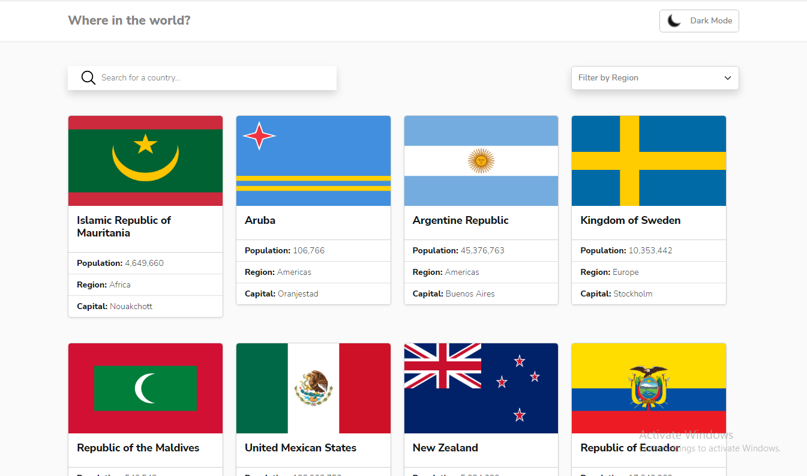
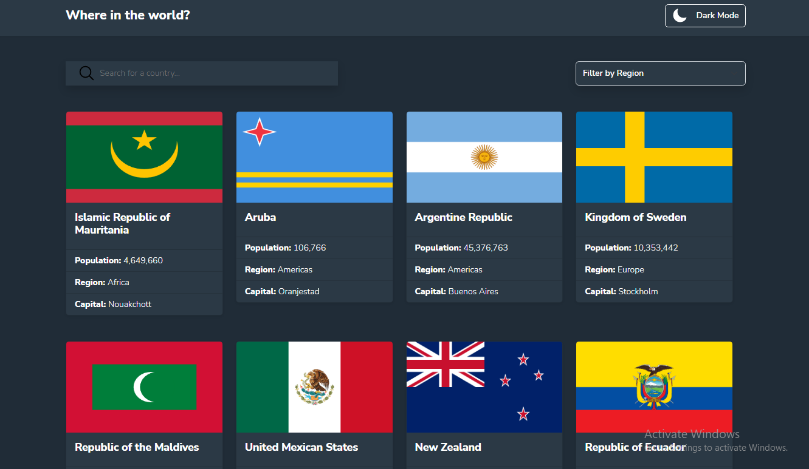
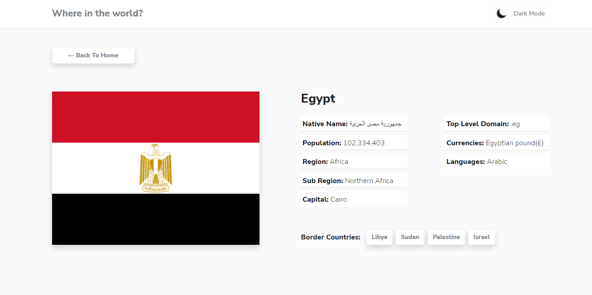
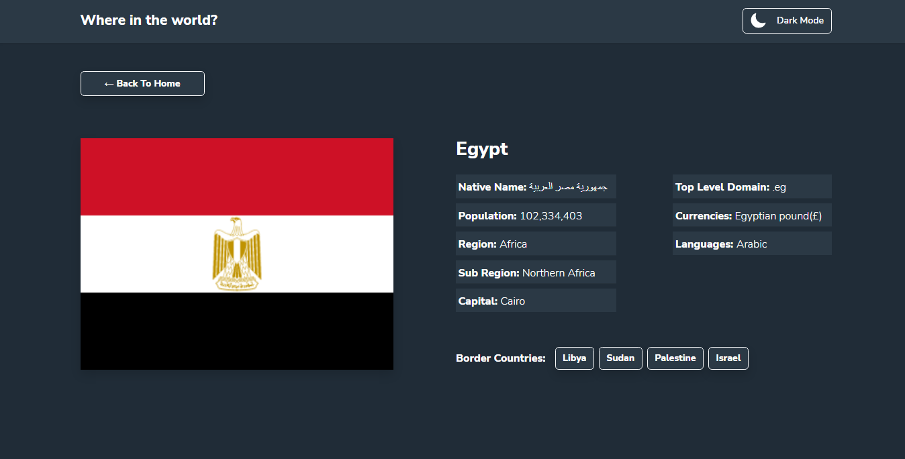

# Frontend Mentor - REST Countries API with color theme switcher solution

This is a solution to the [REST Countries API with color theme switcher challenge on Frontend Mentor](https://www.frontendmentor.io/challenges/rest-countries-api-with-color-theme-switcher-5cacc469fec04111f7b848ca). Frontend Mentor challenges help you improve your coding skills by building realistic projects.

## Table of contents

- [Frontend Mentor - REST Countries API with color theme switcher solution](#frontend-mentor---rest-countries-api-with-color-theme-switcher-solution)
  - [Table of contents](#table-of-contents)
  - [Overview](#overview)
    - [The challenge](#the-challenge)
    - [Screenshot](#screenshot)
    - [Links](#links)
    - [Built with](#built-with)
  - [Author](#author)

**Note: Delete this note and update the table of contents based on what sections you keep.**

## Overview

### The challenge

Users should be able to:

- See all countries from the API on the homepage
- Search for a country using an `input` field
- Filter countries by region
- Click on a country to see more detailed information on a separate page
- Click through to the border countries on the detail page
- Toggle the color scheme between light and dark mode

### Screenshot

### Links

- Solution URL: [Github](https://github.com/moamed018/countries-app)
- Frontend Mentor URL: [Frontend Mentor](https://your-solution-url.com)
- Live Site URL: [Github Pages](https://moamed018.github.io/countries-app/)
- Live Site URL Surge: [Surge](http://countries-app-moamed018.surge.sh/)

### Built with

- CSS custom properties
- Flexbox
- CSS Grid
- [React](https://reactjs.org/) - JS library
- [React Router](https://reactrouter.com/)
- [Bootstrap 5](https://getbootstrap.com/) - For styles

## Author

- Mohamed Madgy
- Frontend Mentor - [@moamed018](https://www.frontendmentor.io/profile/moamed018)
- Twitter - [@mmagdy_01612](https://twitter.com/mmagdy_01612)
